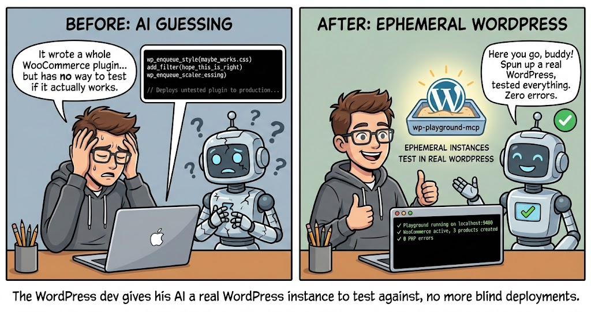

<p align="center">
  
</p>

**Give your AI coding assistant ephemeral WordPress instances for testing instead of hoping the code works.**

## Why This Exists

AI coding assistants can write WordPress plugins and generate Gutenberg content. But they can't verify any of it works. They iterate blindly — writing code, guessing it's correct, moving on:

- Writes a WooCommerce extension → can't check if products actually render
- Generates block markup → can't verify it doesn't trigger "Attempt Block Recovery"
- Hooks into `woocommerce_product_tabs` → can't confirm the tab appears
- Creates 100 test products → can't see if import actually succeeded

The agent has no runtime. No WordPress instance to test against. No way to close the loop.

## The Solution

> **What is WordPress Playground?** [WordPress Playground](https://wordpress.org/playground/) is an official WordPress project that runs a full WordPress instance entirely in WebAssembly — in the browser or on the command line. No Docker, no MySQL, no Apache. It boots in seconds, runs completely in-process, and leaves nothing behind when stopped. Think of it as a disposable WordPress that spins up instantly. ([Learn more](https://developer.wordpress.org/playground/))

`wp-playground-mcp` wraps [@wp-playground/cli](https://github.com/WordPress/wordpress-playground) as an MCP server, giving any AI assistant the ability to:

1. **Generate a Blueprint** — the agent writes a JSON blueprint describing the desired WordPress setup
2. **Boot an instance** — ephemeral WordPress via WebAssembly, no Docker, no MySQL, no server config
3. **Run WP-CLI commands** — query posts, create content, activate plugins, check options
4. **Inspect logs and errors** — catch PHP errors, verify everything loaded correctly
5. **Tear it down** — clean shutdown, no artifacts left behind

This is the third MCP in the [PluginsLab](https://github.com/pluginslab) ecosystem:

| MCP | Purpose |
|-----|---------|
| [wp-devdocs-mcp](https://github.com/pluginslab/wp-devdocs-mcp) | Verified hooks/filters/APIs for writing plugin **code** |
| [wp-blockmarkup-mcp](https://github.com/pluginslab/wp-blockmarkup-mcp) | Verified block schemas for generating **content** |
| **wp-playground-mcp** (this) | Ephemeral WordPress instances for **testing** |

Together: **author → validate → test**.

## Quick Start

```bash
# Clone and install
git clone https://github.com/pluginslab/wp-playground-mcp.git
cd wp-playground-mcp
npm install
```

Add to your Claude Code MCP configuration (`.mcp.json` in your project root):

```json
{
  "mcpServers": {
    "wp-playground": {
      "command": "npx",
      "args": ["--prefix", "/absolute/path/to/wp-playground-mcp", "wp-playground-mcp"]
    }
  }
}
```

First test — ask your assistant:

> "Spin up a WordPress Playground with WooCommerce and create 3 test products."

The agent will use `get_blueprint_schema` to learn the blueprint format, `start_playground` to boot the instance, and `wp_cli` to create products and verify they exist.

## MCP Tools

### `get_blueprint_schema`

Returns the complete Blueprint format reference — all step types, resource types, properties, and examples. The agent uses this to generate valid blueprints without hallucinating step names.

```
→ get_blueprint_schema()
← Full reference with 25 step types, 8 resource types, and 4 example blueprints
```

### `start_playground`

Boots an ephemeral WordPress instance from a Blueprint JSON.

```
→ start_playground({
    blueprint: {
      plugins: ["woocommerce"],
      login: true,
      steps: [
        { step: "setSiteOptions", options: { blogname: "My Store" } }
      ]
    },
    options: { port: 9400 }
  })
← Playground running at http://localhost:9400 (instance: a1b2c3d4)
```

The MCP auto-injects `extraLibraries: ["wp-cli"]`, `login: true`, and `features.networking: true` if not present. Validates the blueprint before booting — catches typos like `installPlugins` instead of `installPlugin`.

### `wp_cli`

Runs WP-CLI commands against the active instance. Supports: `option`, `post`, `plugin`, `theme`, `user`, `site`, `db`, `eval`, `transient`, `menu`, `search-replace`.

```
→ wp_cli({ command: "post list --format=json" })
← [{"ID":1,"post_title":"Hello world!","post_status":"publish",...}]

→ wp_cli({ command: "option get blogname" })
← My Store

→ wp_cli({ command: "plugin list --format=json" })
← [{"name":"WooCommerce","status":"active","version":"9.5.1",...}]
```

### `get_playground_info`

Returns the status of the active instance — URL, port, uptime, blueprint used.

```
→ get_playground_info()
← Running: yes | URL: http://localhost:9400 | Uptime: 5m 23s | Plugins: woocommerce
```

### `stop_playground`

Stops the active instance and cleans up resources.

```
→ stop_playground()
← Stopped instance a1b2c3d4 (uptime: 12m 45s)
```

### `get_playground_logs`

Returns recent logs from the Playground process. Filter by type for targeted debugging.

```
→ get_playground_logs({ lines: 20, type: "error" })
← PHP errors and warnings from the instance
```

## CLI Reference

The CLI mirrors the MCP tools for manual use:

```bash
# Start from a blueprint file
wp-playground start --blueprint=./blueprint.json

# Start with inline options
wp-playground start --wp=6.7 --php=8.3 --plugin woocommerce jetpack

# Run WP-CLI commands
wp-playground wp "post list --format=json"
wp-playground wp "option get blogname"

# Check status
wp-playground status

# View logs
wp-playground logs
wp-playground logs --lines=100 --type=error

# Stop
wp-playground stop

# Print blueprint schema reference
wp-playground schema
```

## How It Works

### Process Management

When `start_playground` is called, the MCP:

1. **Validates** the blueprint against known step types and required parameters
2. **Enhances** the blueprint with wp-cli, login, networking, and the MCP bridge mu-plugin
3. **Spawns** `npx @wp-playground/cli server` as a child process with the blueprint
4. **Polls** the server URL until WordPress is ready (timeout: 120s)
5. **Writes** a state file to `~/.wp-playground-mcp/instances/active.json`

On MCP restart, it checks the state file — if the PID is still alive, it reconnects. If the PID is dead, it cleans up the stale file.

### WP-CLI Execution

WP-CLI commands are executed via a PHP bridge. During blueprint setup, the MCP injects an mu-plugin (`mcp-bridge.php`) that registers a REST endpoint at `/wp-json/mcp/v1/eval`. The MCP server translates WP-CLI commands into equivalent PHP code and sends it to this endpoint.

Supported WP-CLI subcommands:
- `option` — get, update, add, delete, list
- `post` — list, create, get, update, delete
- `plugin` — list, activate, deactivate
- `theme` — list, activate
- `user` — list, create, get
- `site` — info
- `db` — query
- `eval` — arbitrary PHP
- `transient` — get, set, delete
- `menu` — list, create
- `search-replace` — database-wide find and replace

For commands not supported via the bridge (like WooCommerce CLI), include them as `wp-cli` steps in the blueprint — they'll execute during startup.

### Blueprint Validation

Before booting, the MCP validates:
- **Step types** — checks against the 25 known types, suggests corrections for typos
- **Required parameters** — each step's mandatory fields are verified
- **Resource types** — validates resource references (`wordpress.org/plugins`, `url`, `literal`, etc.)
- **PHP versions** — validates against supported versions (7.4 – 8.5)

### Data Storage

```
~/.wp-playground-mcp/
  instances/
    active.json        # State file for the running instance
  blueprints/
    last-used.json     # Cache of the last blueprint
  logs/
    playground.log     # Stdout/stderr from the Playground process
```

## Companion Tools

### Full PluginsLab Stack

For the complete AI-assisted WordPress development workflow, use all three MCPs together:

- [**wp-devdocs-mcp**](https://github.com/pluginslab/wp-devdocs-mcp) — verified hooks, filters, and APIs for writing plugin code
- [**wp-blockmarkup-mcp**](https://github.com/pluginslab/wp-blockmarkup-mcp) — verified block schemas for generating Gutenberg content
- **wp-playground-mcp** (this project) — ephemeral WordPress instances for testing

```json
{
  "mcpServers": {
    "wp-devdocs": {
      "command": "npx",
      "args": ["--prefix", "/path/to/wp-devdocs-mcp", "wp-devdocs-mcp"]
    },
    "wp-blockmarkup": {
      "command": "npx",
      "args": ["--prefix", "/path/to/wp-blockmarkup-mcp", "wp-blockmarkup-mcp"]
    },
    "wp-playground": {
      "command": "npx",
      "args": ["--prefix", "/path/to/wp-playground-mcp", "wp-playground-mcp"]
    }
  }
}
```

### Example: "Build me a WooCommerce product FAQ tab plugin and test it"

One prompt. The agent uses all three MCPs to go from nothing to a tested, working plugin:

**Phase 1 — Write the plugin with verified hooks** (wp-devdocs-mcp)

1. `search_hooks("woocommerce product tab")` → finds `woocommerce_product_tabs` and `woocommerce_product_tab_panels`
2. `validate_hook("woocommerce_product_tabs")` → confirmed: filter, 1 param, returns array of tabs
3. `get_hook_context("woocommerce_product_tabs")` → sees how other plugins register tabs, learns the expected array structure (`title`, `priority`, `callback`)
4. Agent writes a plugin that adds a "FAQ" tab using the verified hook signature — no guessing

**Phase 2 — Generate the FAQ content with verified markup** (wp-blockmarkup-mcp)

5. `search_blocks("accordion")` → finds `core/details` block for collapsible FAQ items
6. `get_block_schema("core/details")` → gets the exact attributes, inner block structure, and valid markup
7. `validate_markup(generated)` → confirms the FAQ content passes structural validation
8. Agent generates 5 FAQ entries as valid Gutenberg block markup — no "Attempt Block Recovery"

**Phase 3 — Boot, deploy, and verify everything works** (wp-playground-mcp)

9. `start_playground` → boots WooCommerce with the plugin injected via `writeFile` + the FAQ content loaded via `wp-cli` steps
10. `wp_cli("plugin list --format=json")` → confirms the FAQ plugin is active alongside WooCommerce
11. `wp_cli("post list --post_type=product --format=json")` → verifies test products exist
12. `wp_cli("option get blogname")` → sanity check, site is alive
13. `get_playground_logs(type: "error")` → zero PHP errors, no warnings
14. Agent reports: "Plugin works. 3 products with FAQ tabs, no errors. Instance running at http://localhost:9400 if you want to check."
15. `stop_playground` → clean shutdown

**The result:** a tested WooCommerce plugin built entirely from verified APIs, with validated content, running against a real WordPress instance — from a single prompt.

## Requirements

- **Node.js 20+**
- **npx** access (for downloading `@wp-playground/cli` on demand)
- No Docker, no MySQL, no Apache — WordPress runs in WebAssembly

## License

MIT
